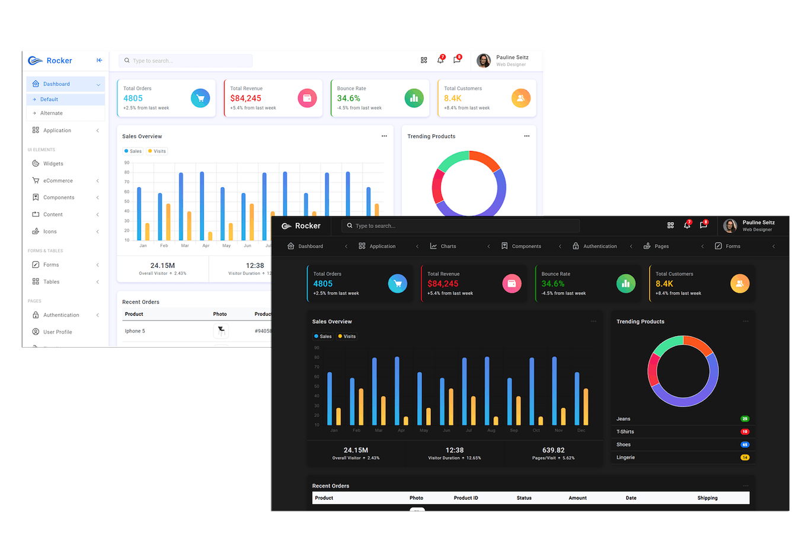

# DashboardHtmlCssBoopstrap
<h3>Responsive Admin Dashboard With Bootstrap 5</h3>

Youtube Channel https://www.youtube.com/channel/UC8c4OFeOvNGmUlHLfQb9TVg

# Video Paso a paso
https://chriscursos.com/p/crear-dashboard-con-html-css-y-boopstrap

